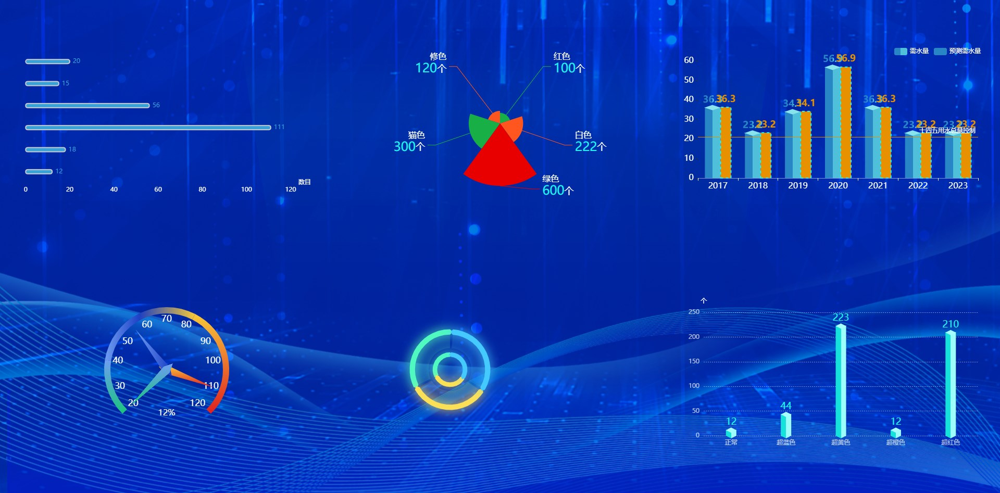

## 效果图



### 横向胶囊图

### 使用v-charts封装

#### 父级组件使用

```js
// Father.Vue
// 引入
import VChartBar from './VchartBar.vue'

components: {
    VChartBar,
},

// 设置默认数据

data() {  
    return {
      ranksLabelColor: '#1EF8F2',
      ranksBarName: '',
      ranksColor: ['#15E2DB', '#9DFDFB', '#A6FFFF'],
      barData: {
        columns: ['name', 'date'],
        rows: [
          { name: '正常', date: '12' },
          { name: '超蓝色', date: '44' },
          { name: '超黄色', date: '223' },
          { name: '超橙色', date: '12' },
          { name: '超红色', date: '210' },
        ]
      },
      rankUnit: 'mm',
    }
}

// template使用
    <section class="six">
      <v-chart-bar 
      height="100%" 
      width="100%" 
      ref="rehearsalChart" 
      :barWidth='20' 
      :barData="barData" 
      :colorArr="ranksColor" 
      :labelColor="ranksLabelColor" 
      :barName="ranksBarName" 
      :unit="rankUnit" 
      </v-chart-bar>
    </section>
```

#### `VchartBar.Vue`

```js
// VchartBar.Vue
<template>
  <ve-histogram 
      ref="charthistogram" 
      height="100%" 
      width="100%" 
      :data="barData" 
      :settings="barOption.setting" 
      :extend="barOption.extend" 
      :grid="barOption.grid" 
      :data-zoom="barOption.dataZoom" 
      :tooltip-visible="false" 
      :legend-visible="false" :after-config="barConfig" 
  />
</template>
```

```js
<template>
  <ve-histogram 
      ref="charthistogram" 
      height="100%" 
      width="100%" 
      :data="barData" 
      :settings="barOption.setting" 
      :extend="barOption.extend" 
      :grid="barOption.grid" 
      :data-zoom="barOption.dataZoom" 
      :tooltip-visible="false" 
      :legend-visible="false" :after-config="barConfig" 
  />
</template>

<script>
export default {
  name: '',
  props: {
    barData: {
      type: Object,
      default: () => {
        return {};
      }
    },
    colorArr: {
      type: Array,
      default: () => {
        return ['#15E2DB', '#9DFDFB', '#A6FFFF'];
      }
    },
    labelColor: {
      type: String,
      default: '#1EF8F2'
    },
    barName: {
      type: String,
      default: '数据'
    },
    unit: {
      type: String,
      defauly: '个'
    },
    barWidth: {
      type: Number,
      defauly: 30
    }
  },
  watch: {
    labelColor: function (val) {
      this.barOption.extend.legend.textStyle.color = val;
    },
    unit: function (val) {
      this.barOption.extend.yAxis.name = val;
    }
  },
  data() {
    return {
      barOption: {
        dataZoom: {
          type: 'inside',
          startValue: 0,
          endValue: 4
        },
        grid: {
          top: 40,
          bottom: '1%',
          containLabel: true
        },
        extend: {
          barWidth: 50,
          legend: {
            show: true,
            right: 0,
            top: 0,
            icon: 'circle',
            itemWidth: 30,
            itemHeight: 8,
            textStyle: {
              color: '#15E2DB',
              fontSize: 12
            }
          },
          xAxis: {
            axisLabel: {
              color: 'rgba(255,255,255,0.70)',
              interval: 0,
              fontSize: '16'
            }
          },
          yAxis: {
            name: '个',
            position: 'left',
            nameTextStyle: {
              color: 'rgba(255,255,255,0.70)',
              fontSize:  '16'
            },
            axisLine: {
              show: false
            },
            axisLabel: {
              color: 'rgba(255,255,255,0.70)',
              fontSize:  '16'
            },
            splitLine: {
              lineStyle: {
                type: 'dotted',
                color: '#fff',
                opacity: 0.5
              }
            }
          }
        }
      }
    };
  },
  mounted() {
    let myChart = this.$refs['charthistogram'].echarts;
    let _this = this
    myChart.getZr().on('click', function (param) {
      // 获取 点击的 触发点像素坐标
      const pointInPixel = [param.offsetX, param.offsetY];
      // 判断给定的点是否在指定的坐标系或者系列上
      if (myChart.containPixel('grid', pointInPixel)) {
        // 获取到点击的 x轴 下标  转换为逻辑坐标
        let xIndex = myChart.convertFromPixel({ seriesIndex: 0 }, pointInPixel)[0];
        // 做一些其他事情
        _this.$emit('barClick', xIndex);
      }
    });
  },
  methods: {
    resize() {
      this.$refs['charthistogram'].echarts.resize();
    },
    barConfig(options) {
      let data = options.series[0].data;
      let colorArr = this.colorArr;
      let labelColor = this.labelColor;
      let color = {
        type: 'linear',
        x: 0,
        x2: 1,
        y: 0,
        y2: 0,
        colorStops: [
          {
            offset: 0,
            color: colorArr[0]
          },
          {
            offset: 0.5,
            color: colorArr[0]
          },
          {
            offset: 0.5,
            color: colorArr[1]
          },
          {
            offset: 1,
            color: colorArr[1]
          }
        ]
      };
      let barWidth = this.barWidth;
      let constData = [];
      let showData = [];
      data.filter(function (item) {
        if (item) {
          constData.push(1);
          showData.push(item);
        } else {
          constData.push(0);
          showData.push({
            value: 1,
            itemStyle: {
              normal: {
                borderColor: 'rgba(0,0,0,0)',
                borderWidth: 2,
                color: 'rgba(0,0,0,0)'
              }
            }
          });
        }
      });

      options.series = [
        {
          z: 1,
          name: this.barName,
          type: 'bar',
          barWidth: barWidth,
          barGap: '0%',
          data: data,
          itemStyle: {
            normal: {
              color: color
            }
          },
          label: {
            show: true,
            fontSize: 18,
            position: 'top',
            color: labelColor
            // formatter: ({ value }) => Number(value).toFixed(1),
          }
        },
        {
          z: 2,
          name: this.barName,
          type: 'pictorialBar',
          data: constData,
          symbol: 'diamond',
          symbolOffset: ['0%', '50%'],
          symbolSize: [barWidth, 10],
          itemStyle: {
            normal: {
              color: color
            }
          },
          tooltip: {
            show: false
          }
        },
        {
          z: 3,
          name: this.barName,
          type: 'pictorialBar',
          symbolPosition: 'end',
          data: showData,
          symbol: 'diamond',
          symbolOffset: ['0%', '-50%'],
          symbolSize: [barWidth - 4, (10 * (barWidth - 4)) / barWidth],
          itemStyle: {
            normal: {
              borderColor: colorArr[2],
              borderWidth: 2,
              color: colorArr[2]
            }
          },
          tooltip: {
            show: false
          }
        }
      ];
      return options;
    }
  }
};
</script>
```

## echarts动态设置图表大小

```js
//
Vue.directive('onEchartResize', {
  bind(el) {
    el['_changeEchartsSize'] = () => {
      let chart = echarts.getInstanceByDom(el);
      if (!chart) {
        return;
      }
      setTimeout(() => {
        chart.resize()
      }, 0)
    }
    window.addEventListener('resize', el['_changeEchartsSize']);
  },
  unbind(el) {
    // 解除事件监听
    document.removeEventListener("click", el['_changeEchartsSize']);
    delete el['_changeEchartsSize'];
  },
})
```

## el-input自动聚焦

```js
Vue.directive('focus', function (el, option) {
    var defClass = 'el-input', defTag = 'input';
    var value = option.value || true;

    if (typeof value === 'boolean')
        value = { cls: defClass, tag: defTag, foc: value };
    else
        value = { cls: value.cls || defClass, tag: value.tag || defTag, foc: value.foc || false };

    if (el.classList.contains(value.cls) && value.foc) {
        Vue.nextTick(function () {
            // console.log(value.tag)
            el.getElementsByTagName(value.tag)[0].focus();
        })
    }
});
```

## 按钮级权限控制

```js
Vue.directive("permission", {
  inserted: (el, bind) => {
    let per = bind.value
    let arr = localData('get', 'permission')
    if(!arr.includes(per)){
      el.parentNode.removeChild(el);
    }
  }
})
```

## 弹窗拖拽

```js
// v-dialogDrag: 弹窗拖拽属性
Vue.directive("dialogdrag", {
  //属性名称dialogDrag，前面加v- 使用
  bind(el, binding, vnode, oldVnode) {
    const dialogHeaderEl = el.querySelector(".el-dialog__header");
    const dragDom = el.querySelector(".el-dialog");
    //dialogHeaderEl.style.cursor = 'move';
    dialogHeaderEl.style.cssText += ";cursor:move;";
    dragDom.style.cssText += ";top:0px;";

    // 获取原有属性 ie dom元素.currentStyle 火狐谷歌 window.getComputedStyle(dom元素, null);
    const sty = (function() {
      if (window.document.currentStyle) {
        return (dom, attr) => dom.currentStyle[attr];
      } else {
        return (dom, attr) => getComputedStyle(dom, false)[attr];
      }
    })();

    dialogHeaderEl.onmousedown = (e) => {
      // 鼠标按下，计算当前元素距离可视区的距离
      const disX = e.clientX - dialogHeaderEl.offsetLeft;
      const disY = e.clientY - dialogHeaderEl.offsetTop;

      const screenWidth = document.body.clientWidth; // body当前宽度
      const screenHeight = document.documentElement.clientHeight; // 可见区域高度(应为body高度，可某些环境下无法获取)

      const dragDomWidth = dragDom.offsetWidth; // 对话框宽度
      const dragDomheight = dragDom.offsetHeight; // 对话框高度

      const minDragDomLeft = dragDom.offsetLeft;
      const maxDragDomLeft = screenWidth - dragDom.offsetLeft - dragDomWidth;

      const minDragDomTop = dragDom.offsetTop;
      const maxDragDomTop = screenHeight - dragDom.offsetTop - dragDomheight;

      // 获取到的值带px 正则匹配替换
      let styL = sty(dragDom, "left");
      let styT = sty(dragDom, "top");

      // 注意在ie中 第一次获取到的值为组件自带50% 移动之后赋值为px
      if (styL.includes("%")) {
        styL = +document.body.clientWidth * (+styL.replace(/\%/g, "") / 100);
        styT = +document.body.clientHeight * (+styT.replace(/\%/g, "") / 100);
      } else {
        styL = +styL.replace(/\px/g, "");
        styT = +styT.replace(/\px/g, "");
      }

      document.onmousemove = function(e) {
        // 通过事件委托，计算移动的距离
        let left = e.clientX - disX;
        let top = e.clientY - disY;

        // 边界处理
        if (-left > minDragDomLeft) {
          left = -minDragDomLeft;
        } else if (left > maxDragDomLeft) {
          left = maxDragDomLeft;
        }

        if (-top > minDragDomTop) {
          top = -minDragDomTop;
        } else if (top > maxDragDomTop) {
          top = maxDragDomTop;
        }

        // 移动当前元素
        dragDom.style.cssText += `;left:${left + styL}px;top:${top + styT}px;`;
      };

      document.onmouseup = function(e) {
        document.onmousemove = null;
        document.onmouseup = null;
      };
    };
  },
});
```

### 弹窗拖拽+水平方向伸缩

```js
// v-dialogDrag: 弹窗拖拽+水平方向伸缩
Vue.directive("dialogDrag", {
  bind(el, binding, vnode, oldVnode) {
    //弹框可拉伸最小宽高
    let minWidth = 400;
    let minHeight = 300;
    //初始非全屏
    let isFullScreen = false;
    //当前宽高
    let nowWidth = 0;
    let nowHight = 0;
    //当前顶部高度
    let nowMarginTop = 0;
    //获取弹框头部（这部分可双击全屏）
    const dialogHeaderEl = el.querySelector(".el-dialog__header");
    //弹窗
    const dragDom = el.querySelector(".el-dialog");
    //给弹窗加上overflow auto；不然缩小时框内的标签可能超出dialog；
    dragDom.style.overflow = "auto";
    //清除选择头部文字效果
    //dialogHeaderEl.onselectstart = new Function("return false");
    //头部加上可拖动cursor
    dialogHeaderEl.style.cursor = "move";
    // 获取原有属性 ie dom元素.currentStyle 火狐谷歌 window.getComputedStyle(dom元素, null);
    const sty = dragDom.currentStyle || window.getComputedStyle(dragDom, null);
    let moveDown = (e) => {
      // 鼠标按下，计算当前元素距离可视区的距离
      const disX = e.clientX - dialogHeaderEl.offsetLeft;
      const disY = e.clientY - dialogHeaderEl.offsetTop;
      // 获取到的值带px 正则匹配替换
      let styL, styT;
      // 注意在ie中 第一次获取到的值为组件自带50% 移动之后赋值为px
      if (sty.left.includes("%")) {
        styL =
          +document.body.clientWidth * (+sty.left.replace(/\%/g, "") / 100);
        styT =
          +document.body.clientHeight * (+sty.top.replace(/\%/g, "") / 100);
      } else {
        styL = +sty.left.replace(/\px/g, "");
        styT = +sty.top.replace(/\px/g, "");
      }
      document.onmousemove = function(e) {
        // 通过事件委托，计算移动的距离
        const l = e.clientX - disX;
        const t = e.clientY - disY;
        // 移动当前元素
        dragDom.style.left = `${l + styL}px`;
        dragDom.style.top = `${t + styT}px`;
        //将此时的位置传出去
        //binding.value({x:e.pageX,y:e.pageY})
      };
      document.onmouseup = function(e) {
        document.onmousemove = null;
        document.onmouseup = null;
      };
    };
    dialogHeaderEl.onmousedown = moveDown;
    //双击头部全屏效果
    dialogHeaderEl.ondblclick = (e) => {
      if (isFullScreen == false) {
        nowHight = dragDom.clientHeight;
        nowWidth = dragDom.clientWidth;
        nowMarginTop = dragDom.style.marginTop;
        dragDom.style.left = 0;
        dragDom.style.top = 0;
        dragDom.style.height = "100VH";
        dragDom.style.width = "100VW";
        dragDom.style.marginTop = 0;
        isFullScreen = true;
        dialogHeaderEl.style.cursor = "initial";
        dialogHeaderEl.onmousedown = null;
      } else {
        dragDom.style.height = "auto";
        dragDom.style.width = nowWidth + "px";
        dragDom.style.marginTop = nowMarginTop;
        isFullScreen = false;
        dialogHeaderEl.style.cursor = "move";
        dialogHeaderEl.onmousedown = moveDown;
      }
    };
    dragDom.onmousemove = function(e) {
      let moveE = e;
      if (
        e.clientX > dragDom.offsetLeft + dragDom.clientWidth - 10 ||
        dragDom.offsetLeft + 10 > e.clientX
      ) {
        dragDom.style.cursor = "w-resize";
      } else if (
        el.scrollTop + e.clientY >
        dragDom.offsetTop + dragDom.clientHeight - 10
      ) {
        dragDom.style.cursor = "s-resize";
      } else {
        dragDom.style.cursor = "default";
        dragDom.onmousedown = null;
      }
      dragDom.onmousedown = (e) => {
        const clientX = e.clientX;
        const clientY = e.clientY;
        let elW = dragDom.clientWidth;
        let elH = dragDom.clientHeight;
        let EloffsetLeft = dragDom.offsetLeft;
        let EloffsetTop = dragDom.offsetTop;
        dragDom.style.userSelect = "none";
        let ELscrollTop = el.scrollTop;
        //判断点击的位置是不是为头部
        if (
          clientX > EloffsetLeft &&
          clientX < EloffsetLeft + elW &&
          clientY > EloffsetTop &&
          clientY < EloffsetTop + 100
        ) {
          //如果是头部在此就不做任何动作，以上有绑定dialogHeaderEl.onmousedown = moveDown;
        } else {
          document.onmousemove = function(e) {
            e.preventDefault(); // 移动时禁用默认事件
            //左侧鼠标拖拽位置
            if (clientX > EloffsetLeft && clientX < EloffsetLeft + 10) {
              //往左拖拽
              if (clientX > e.clientX) {
                dragDom.style.width = elW + (clientX - e.clientX) * 2 + "px";
              }
              //往右拖拽
              if (clientX < e.clientX) {
                if (dragDom.clientWidth < minWidth) {
                } else {
                  dragDom.style.width = elW - (e.clientX - clientX) * 2 + "px";
                }
              }
            }
            //右侧鼠标拖拽位置
            if (
              clientX > EloffsetLeft + elW - 10 &&
              clientX < EloffsetLeft + elW
            ) {
              //往左拖拽
              if (clientX > e.clientX) {
                if (dragDom.clientWidth < minWidth) {
                } else {
                  dragDom.style.width = elW - (clientX - e.clientX) * 2 + "px";
                }
              }
              //往右拖拽
              if (clientX < e.clientX) {
                dragDom.style.width = elW + (e.clientX - clientX) * 2 + "px";
              }
            }
            //底部鼠标拖拽位置
            if (
              ELscrollTop + clientY > EloffsetTop + elH - 20 &&
              ELscrollTop + clientY < EloffsetTop + elH
            ) {
              //往上拖拽
              if (clientY > e.clientY) {
                if (dragDom.clientHeight < minHeight) {
                } else {
                  dragDom.style.height = elH - (clientY - e.clientY) * 2 + "px";
                }
              }
              //往下拖拽
              if (clientY < e.clientY) {
                dragDom.style.height = elH + (e.clientY - clientY) * 2 + "px";
              }
            }
          };
          //拉伸结束
          document.onmouseup = function(e) {
            document.onmousemove = null;
            document.onmouseup = null;
          };
        }
      };
    };
  },
});
```
